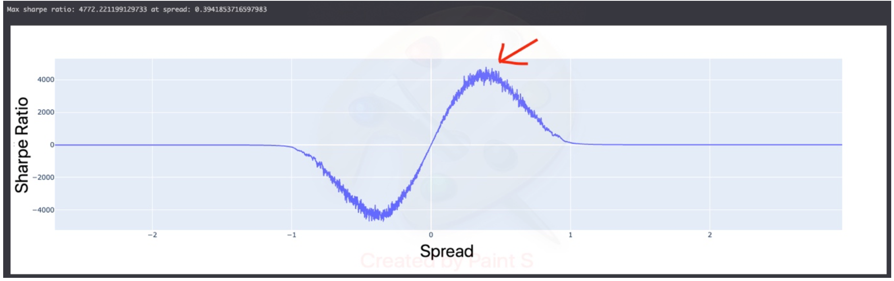

# Summary

To solve this problem, I used a different strategy than the classic development of a forecasting model.  
First of all, I reasoned about the significance of the competition evaluation metric, the sharpe ratio. In this case, the best score is found by selecting stocks in such a way as to maximise the spread but also minimise its volatility over time.

So I carried out a few steps before developing the model:

- for each day carried out 100000 stock allocation simulations with the corresponding spread
- calculated the sharpe ratio that would occur when varying the spread value (graph below)

Identified the target spread value that would generate the best sharpe ratio in the history ( ≃ 0.4)

Once the target spread to be achieved was identified, the strategy consisting of the following steps:

1. for each day-stock to be predicted, the previous n days are retrieved, where n are different lags of the past (3,4,5,6,7)
2. for each LAG, a simple first-degree polynomial is trained to predict the next 2 days and calculate the ratio between the two; in addition, the R2 error on the past is calculated
3. target polynomials on the different lags are then averaged, weighing them by the R2 error
4. Finally, 10000 simulations are run and the spread value as close as possible to ≃0.4 is selected

The model on the basic Kaggle CPU notebook takes about 20-25 minutes to run.

A feature of this solution is that one can improve the result and bring it to convergence either by improving the prediction models (which in this case are very basic) or by increasing the number of simulations performed. Moreover, since there are multiple simulations with random factors, it will be difficult to obtain the exact same results.
