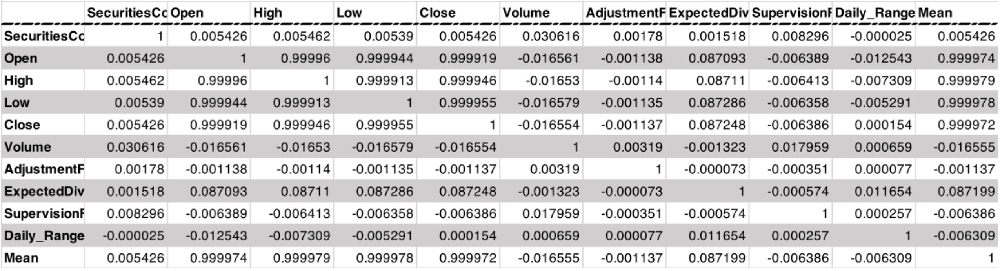
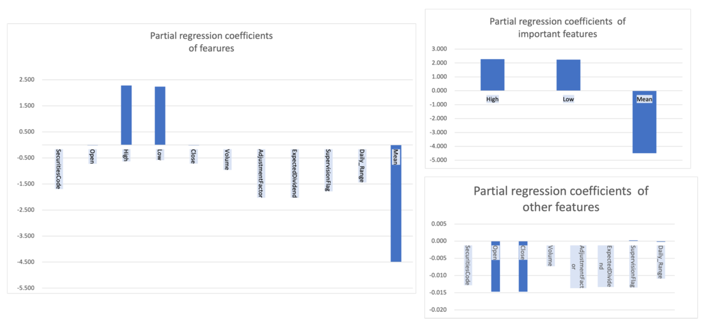
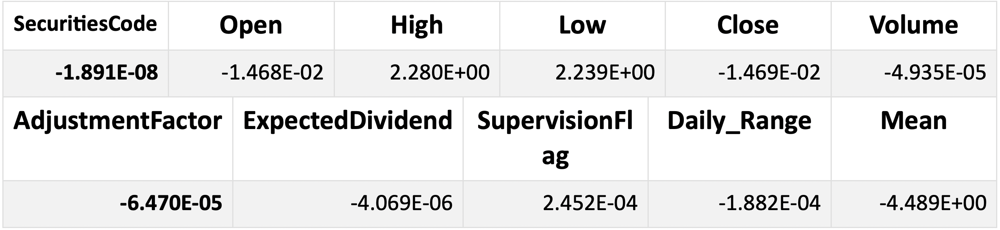

# Summary

I conducted a regression analysis using a linear regression model. The tool used was “LinearRegression”, which is included in Python's linear models in Scikit-learn. Running time was 68.2s. According to the partial regression coefficients, the important features may be the high and low stock prices and their averages.

# Features Selection / Engineering

Since I have no domain knowledge of stock trading, I focused on data files related to stock prices and selected data that I thought could be used as features in the training.
These are “SecuritiesCode”, “Open”, “High”, “Low”, ” Close”, “Volume”, “AdjustmentFactor”, “ExpectedDividend”, and “SupervisionFlag”.
Among these features, the missing values of “ExpectedDividend” are filled with 0, and the missing values of Open, High, Low, Close are filled with the values before and after. In addition, I calculated and added features called “Daily_Range” and “Mean” from these features. And standardization was performed before learning.
The partial regression coefficients obtained from the training results indicate that three features are important: High, Low, and Mean. Figure 1 shows a graph of the partial regression coefficients. Table1 shows the correlations of the features used. It can be seen that the features values related to prices (Open, High, Low, Close, Mean) each show a high correlation.

Table1

Figure1

# Training Method

I used for training LinearRegression, a linear regression model included in Python's Scikit-learn. The partial regression coefficients obtained as a result of the training are shown in Table 2. The partial correlation coefficient of the Mean is negative against the High and Low, which is thought to be since the Mean feature has a strong correlation with the High and Low ($r_{high} = 0.99$, $r_{row}=0.99$ ).

Table2

# Interesting Findings

Stock prices change due to a variety of factors. Therefore, it is very difficult to understand how all of them affect stock prices. So, I think it is possible that the regression score is improved by reducing the number of features as shown in the results of this study.

# Simple Features and Method

Although this model is considered simple enough at this time, there is a possibility that the learning time can be reduced while maintaining sufficient accuracy if only the three features mentioned above (High, Low, Mean) are used. (Note that this is a hypothesis, as I have not been able to test it.)

# Model Execution Time

The model training time is 45.5s, which is the time displayed when submitting my public Kaggle Note.
