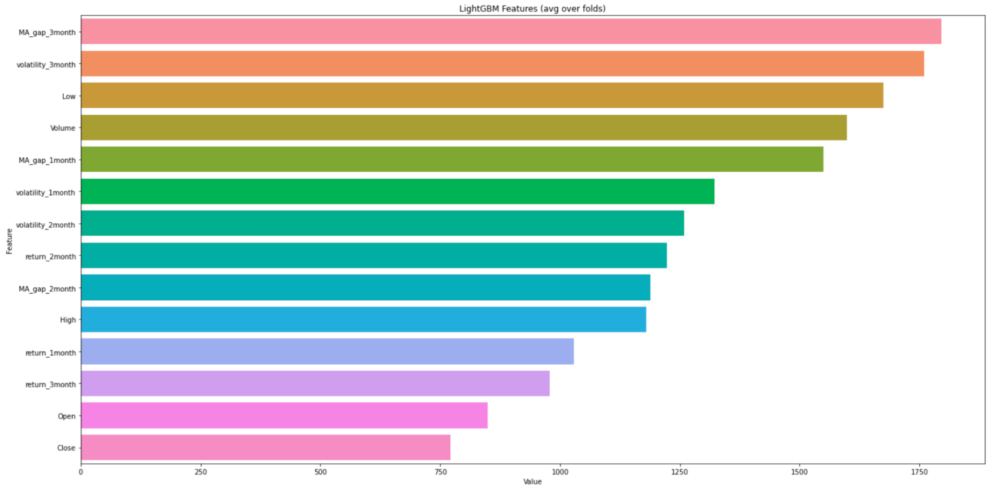

# Summary

The training model that I used is LightGBM. I tried to use LightGBMRanker, XGBoost but the score in CV didn’t improve, so I decided to use LightGBM. I have traded virtual currency myself, and lightgbm has basically scored better than any other model, so I decided to use lightgbm again based on that. The most important feature was Deviation between closing price and 60 business day simple moving average. To train the model and predict, it takes about 336.8 seconds.

# Features Selection / Engineering

The feature importance plot is shown below.

## These are the descriptions of the features

return_1month: 20 business day return of closing price  
return_2month: 40 business day return of closing price  
return_3month: 60 business day return of closing price

volatility_1month: 20 business day volatility of closing price  
volatility_2month: 40 business day volatility of closing price  
volatility_3month: 60 business day volatility of closing price

MA_gap_1month: Deviation between closing price and 20 business day simple moving average  
MA_gap_2month: Deviation between closing price and 40 business day simple moving average  
MA_gap_3month: Deviation between closing price and 60 business day simple moving average

Close: The price at the end of the minute.  
Open: The price at the beginning of the minute.  
Low: The lowest price during the minute.  
High: The highest price during the minute.  
Volume: The number of stock units traded during the minute.

I did not make any special efforts in selecting features, but I was careful not to include too many features. I reduced the number of features because of the running time limitation of the code and because of multicollinearity.

# Training Method(s)

As for the model, I simply solved the model using Lightgbm regression with target as the objective variable. For the training data, I used the bottom 1,000 stocks in the training data, and the top 1,000 stocks were used for the validation data. For the test data, I used information after December 6, 2021 for all 2000 stocks. I didn’t ensemble the model. I looked for features that could increase that cv score, resulting in 14 features.

# Interesting findings

I used features that are common and well-known in the financial industry for machine learning. The code execution time limit made it impossible to include a lot of features, so the model was fairly simple. cv scored only about 0.25, considering my private leaderboard score is 0.36, I think the score was considerably higher on the private leaderboard.

# Simple Features and Methods

I tried reducing the number of features and did it with various combinations of features, but the 14 features I used on the competition gave the best scores.

# Model Execution Time

To train the model, it takes 317.2 seconds on the kaggle notebook. To generate the prediction by using my model, it takes 336 seconds.

# References

SIGNATE: 日本取引所グループ ファンダメンタルズ分析チャレンジ 1 位解法
https://speakerdeck.com/m_mochizuki/the-1st-place-solution-of-jpx-fundamentals-analysis-challenge-on-signate
