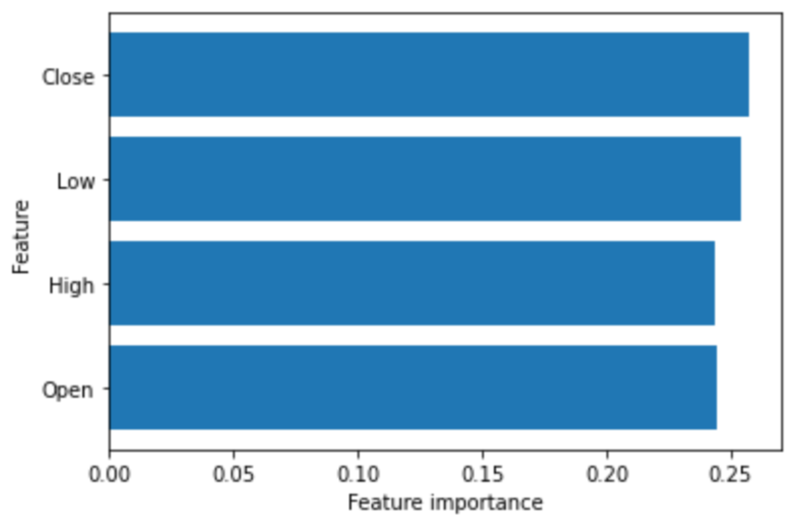

# Summary

4-6 sentences summarizing the most important aspects of your model and analysis, such as:

- The training method(s) you used (Convolutional Neural Network,
  XGBoost)
  DecisionTreeRegressor
- The most important features  
  ['Open','High','Low','Close']
- The tool(s) you used  
  python
- How long it takes to train your model  
  127.00032544136047 second

# Features Selection / Engineering

• What were the most important features?  

We only used four base features and did no other feature engineering

- How did you select features?  
  The score on the Public
- Did you make any important feature transformations?  
  no
- Did you find any interesting interactions between features?  
  No, nofeatureinteraction
- Did you use external data? (if permitted)  
  No

# Training Method(s)

- What training methods did you use?  
  We used a decision tree model, but in the process of parameter tuning, the optimal model was obtained by comparing the scores on the divided validation set

- Did you ensemble the models?  
  only one model
- If you did ensemble, how did you weight the different models?  
  only one model

# Interesting findings

- What was the most important trick you used?
  We used a decision tree model, but in the process of parameter tuning, the optimal model was obtained by comparing the scores on the divided validation set
- What do you think set you apart from others in the competition? Simple model
- Did you find any interesting relationships in the data that don't fit in the sections above?  
  No

# Simple Features and Methods

Many customers are happy to trade off model performance for simplicity. With this in mind:

- Is there a subset of features that would get 90-95% of your final
  performance? Which features? \*  
  'Open','High','Low','Close' features
- What model that was most important? \*  
  Tree model
- What would the simplified model score?  
  0.352

* Try and restrict your simple model to fewer than 10 features and one training method.  
  Only 4 features are used in total

# Model Execution Time

Many customers care about how long the winning models take to train and generate predictions:

- How long does it take to train your model?  
  111 seconds
- How long does it take to generate predictions using your model?  
  277 ms
