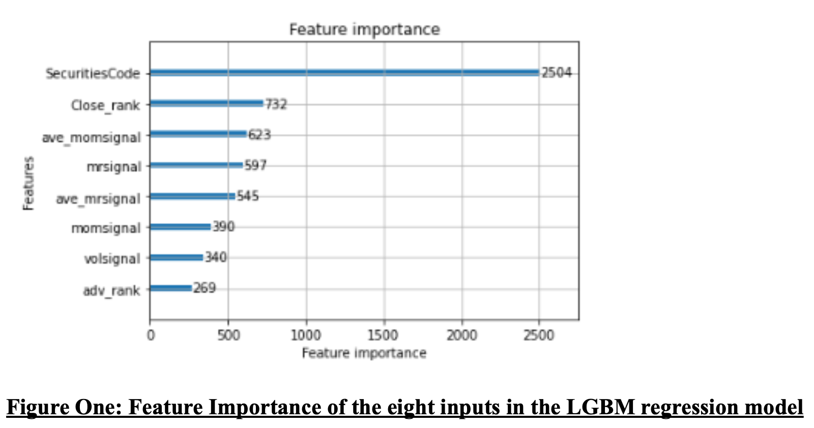

# Summary

Broadly, financial market prediction, from a signaling perspective is considered an extremely weak process, with dependencies often inconsistent and highly variable, changing market conditions as well as various idiosyncratic risks pervasive in financial market time series make prediction of returns extremely challenging. It is generally my preference to de-trend return data by subtracting some element of broad market return for observational periods as there appears to be better predictability in alpha (excess return) than in beta (pure return). Even though the problem is extremely variable there are biases that exist that tend allow some prediction on alpha, these include behavioral, fundamental and other idiosyncratic biases; in this particular case behavioral drivers were found to be the predominate features compared with fundamental aspects. I was very excited to explore the detailed implied volatility data, especially since this should be an excellent market barometer in terms of the change in out-the-money vols giving a view on future expectations of equity market returns. To this end I explored as much as possible in terms of both the term structure as well as the moneyness for both puts and calls. Whilst it turned out that there was a small prediction value and improvement on the out of sample competition metric, in using the near dated average implied vol as a feature, the additional complexity of folding this into the notoriously tricky Kaggle time series methodology and the time that I had to implement, I deemed this better excluded. It would have been really great to have looked rather at single stock vol data rather than what I assume was for the broad market beta.

Whilst the prediction requirement of the competition was presented as predicting $P|_{t+2} / P|_{t+1} - 1$ for each stock (here P is stock price), I looked at various alternative prediction objectives which subtracted the daily average return of the entire stock universe from each stock, defined say as the alpha of each stock. I continued however to optimize on the return metric pertinent to the competition. I found that $(P|_{t+2} / P|_{t+0} - \sum^n_{k=0}(P|_{t+2}/P|_{t+0})/n)$ gave the best optimized competition metric.

I made some adjustments to the data as it seemed to me that the price data was not adjusted for corporate actions or stock splits, however the target return data had been thus I reconstructed all individual stock price time series using the adjusted target values.

In terms of the machine learning algorithm, I tend to prefer the data partitioning philosophy of the gradient boosted decision trees, this in my experience tends to give better results in financial time series compared with the activation function in the neural network space which I see as too constrained, I did try TabNet as well as some DNN structures but abandoned these after it was clear that Light GBM regression model worked best. Typically I try to ensure that the model shows some consistency in prediction over long periods of out-of-sample testing and thus typically use an expanding window with a one month look ahead prediction out-of-sample for metric optimization. This allows for hyperparameter optimization as a function of maximum out of sample return. To this end the machine learning parameters of LGBM tend to ensure that overfitting is minimized that that models tend to be as simple as possible. This in my experience to this point gives more consistent results in terms of generating positive return in market neutral constructs such as is the case in this particular problem definition. Long term monthly out of sample metric values where closer to 0.2 over the three or four years tested.

The most important feature by a significant measure was the previous two day return of each stock which exhibited significant mean reversion of alpha in the next two day period. Other features which increased the long term out of sample return metric included longer term momentum on price returns with a typical exhibited lag component, historical observed standard deviation of returns, a measure of average daily volume as a ranking, the overall price level as a ranked variable and the inclusion of various cross-section averages of the mean reversion and momentum metrics. I also found that defining each stock across a categorical feature inclusion increased the long term objective function. Many of the fundamental features do exhibit a bias although my suspicion is these would likely be better utilized for longer term return expectations. Unfortunately none of their inclusion improved the long term out of sample back test.

Due to the model being extremely simple and not requiring out of fold testing optimization on the data set the model trains extremely quickly.

# Features Selection / Engineering

- What were the most important features?  
  As alluded to above the most important features were largely behavioral and included mean reversion, momentum and observed historic volatility values. Fascinatingly, for this specific problem two aspects significantly increased the out of sample metric this being defining the security code as a categorical feature and training the dataset on the outliers (I found that including only the top and bottom 250 returns across the data added significantly to the objective function). In the final submission I used only eight features, this being: - SecuritiesCode: the unique identifier for each stock as a cat features - Close_rank: A cross sectional ranking of the stock prices - mrsignal: a short term (2 day) historic price return for each stock - momsignal: a longer term (131 trading day historic price return with a 25 day lag) - volsignal: a standard deviation of daily returns for the previous 231 trading days - adv_rank: a cross sectional ranking of average daily volume of the previous 11 trading days - ave_momsignal: a cross sectional average of momsignal - ave_mrsignal: a cross sectional average of mrsignal

The figure below gives the typical feature importance plot as produced by the LGBM software. Most important from this perspective is the categorical feature followed by the price rank, ave_momsignal (momentum tends to be dependent on the broad market average) and mean reversion.

As per above the training of these factors only on the top and bottom 250 performing stocks at each daily interval had a significant impact on the score. Unfortunately I ran out of time to look at including some of the fundamental and volatility data into this subset. It would be interesting to include some of these to see if the score could be improved.

In terms of all other features these are typically included in the optimization training stage however neither the fundamental accounting ratios nor any of the implied volatility value gave additional synergistic benefit and out of sample scoring was diluted.

# Training Method(s)

- The following methodology is utilized in training optimizing feature utilization, feature engineering and hyperparameter tuning:
- An expanding window is utilized with the initial period corresponding to roughly one year of data.
- The Light GBM regression model is fitted to the data
- The next one month period was predicted, ranked and scored according to the competition metric
- This month is then included into the next window and run until a complete set of out of sample scores are generated
- The combined score for a given run is calculated as the mean of the one month results of the complete out of sample set
- Running multiple feature inclusions as well as parameter change generates the final model with best average score across the universe
- Ensemble methods did not show marked improvement and were excluded.

# Interesting findings

- What was the most important trick you used?
  - The unconventional step of training the data on that tails rather than Winsorizing the data was a really interesting trick that made a significant impact on the score. This worked very well when markets where not subjected to significant volatility. I suspect that during periods of increased volatility as observed in the final month of the completion that the observed standard deviation of returns moved out significantly and that this decreased the score achieved. In a competition of this type it is better to be lucky than good and although I suspected we might be subjected to heightened volatility, due to the current macro-economic environment, over the competition phase; I did not specifically try fit a model to this. Interestingly I see that the 4th place model utilized the dividend yield which likely as a value proxy assisted in the performance ability of the model through the final month of the competition.
  - It is perhaps a pity that I did not include some of the implied volatility work in the model as the near dated implied point would likely have responded significantly to current market conditions. Again I would have thought that change in out the money put option volatility would have assisted with this, I didn’t find evidence this in the training set given.
- What do you think set you apart from others in the competition?
  - The simplicity of the model and my understanding of a variety of market specific regimes and limit of signal allow me to create a rigorous model that should likely have put me in good standing regardless of market condition.
- Did you find any interesting relationships in the data that don't fit in the sections above?
  - Inclusion of good quality single stock vol skews would have been amazing to look at.

# Simple Features and Methods

The methodology employed is designed to be as simple as possible to allow for the most rigorous and practical implementation of a trading model. Many practical issues have not been addressed in the modelling and as such this really is a theoretical exercise on capturing alpha in the Japanese stock environment. I suspect that trading costs and turnover as well as the size of the basket would likely make the implementation of this strategy non-economically viable. However longer term prediction windows such as monthly or quarterly designed as a portfolio construction around market capitalization benchmark would have merit and that the quality of data including both the fundamental and implied vol datasets would likely lead to the ability to outperform the broad Nikkei 225.

# Model Execution Time

- How long does it take to train your model?  
  Less than 1 minutes
- How long does it take to generate predictions using your model?  
  Less than 1 minutes
- How long does it take to train the simplified model?  
  The current model is designed to be as simple as possible and no additional simplification for either training or prediction could be made. This considering number of features, simplicity of parameters and use of Light GBM.

# References

All work, use of models, feature engineering and methodology are work of my own design and experience.
