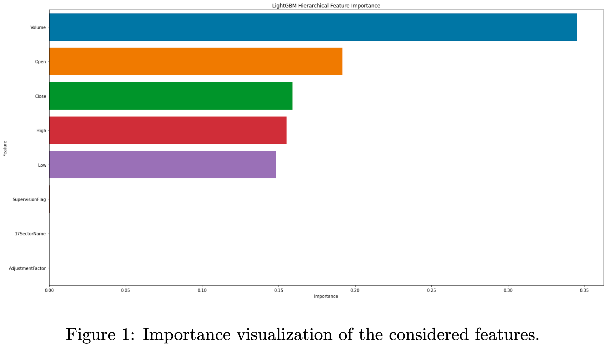
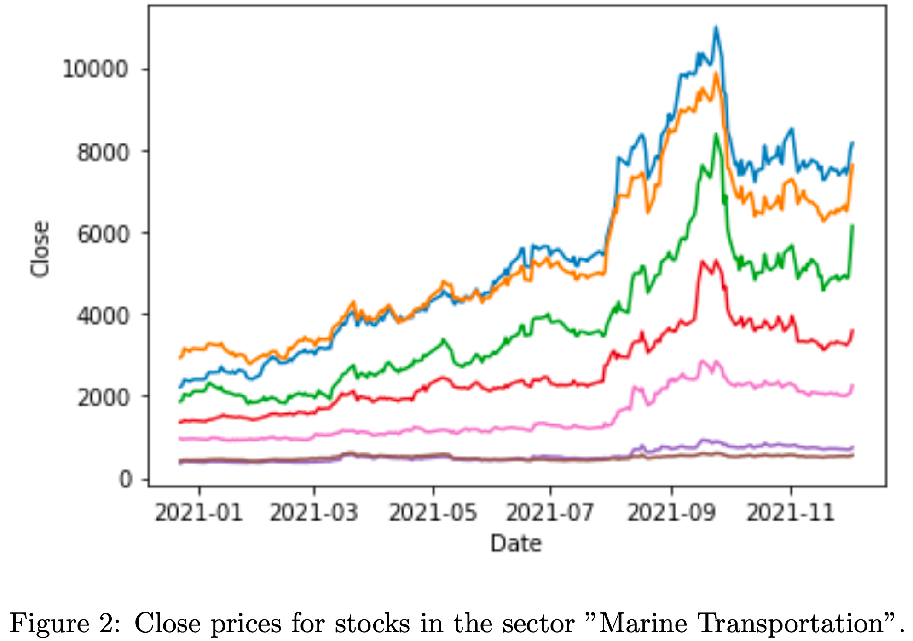

# Summary

Our model consists of several LightGBM regressors. For each sector in 33Sec- torName, one LightGBM regressor was trained. Depending on the sector of the stock, our model selects the corresponding regressor for the prediction. Our prediction target was the rate of change. The most important features were volume, open and close.

To build our model, we used the following tools: 1. Scikit-Learn 2. LightGBM 3. Optuna 4. Pandas 5. Numpy
Training our model took 28.1 seconds.

# Feature Selection / Engineering

As one can see in figure 1, the most important features were volume, open and close. The features 17SectorName and AdjustmentFactor are not relevant for the prediction, and the SuperVisionFlag has almost no influence. The feature 17SectorName has no influence, as it is regarded as a constant due to our par- titioning into sector-specific regressors. We explain the lack of influence of the SupervisionFlag by the fact that the value of this binary feature is almost ex- clusively 0. The same can be said about the AdjustmentFactor which almost always is a value of 1.

We encountered some difficulties in selecting new features, since the public leaderboard score could only serve as a vague and maybe even wrong indi- cation of future predictive performance of our model. We tried to overcome this challenge by using a technique called GroupedTimeSeriesSplit when we were optimizing the hyper-parameters of our regressors. Please note that we will talk more about this technique in the training section of this document. In the end, we decided not to introduce any new features, but to create a robust model with the existing features.

# Training Method(s)

We trained every sector-specific regressor separately, while optimizing the hyper- parameters over all regressors. Every LightGBM regressor of our compound model uses the same hyper-parameters. We optimized the hyper-parameters using Optuna and GroupedTimeSeriesSplit. This method splits a time series into cross-validation groups while keeping the natural order of the time series. It may be possible to improve performance by tuning each sector-specific regressor individually. We opted for the resource-efficient method because we did not expect the performance improvement to be high, validation to be difficult, and because we wanted to avoid overfitting.

# Interesting findings

By far the most important trick we used was to train individual models for each sector. When we looked at the data, we noticed that the prices of stocks in the same sector correlate with each other. For example, figure 2 depicts the correlation of stocks in the marine transportation sector. We assumed that a model would learn much better if it specialized in one sector and exploited this correlation.

# Simple Features and Methods

As we have discussed in the chapter Feature Selection / Engineering, the features 17SectorName, AdjustmentFactor and SupervisionFlag can be thrown out as they have almost no influence on the prediction. After a local test, we found that the model score of the simplified model is equal to the score of the original model.

# Model Execution Time

- How long does it take to train your model?  
  Training our model on gpu took 28.1 seconds.
- How long does it take to generate predictions using your model?  
  Our model needs 0.311 seconds on gpu to predict one day consisting of 2000 stocks.
- How long does it take to train the simplified model?  
  Training our simplified model on gpu took 20.6 seconds.
- How long does it take to generate predictions from the simplified model?  
  Our simplified model needs 0.293 seconds on gpu to predict one day consisting of 2000 stocks.
