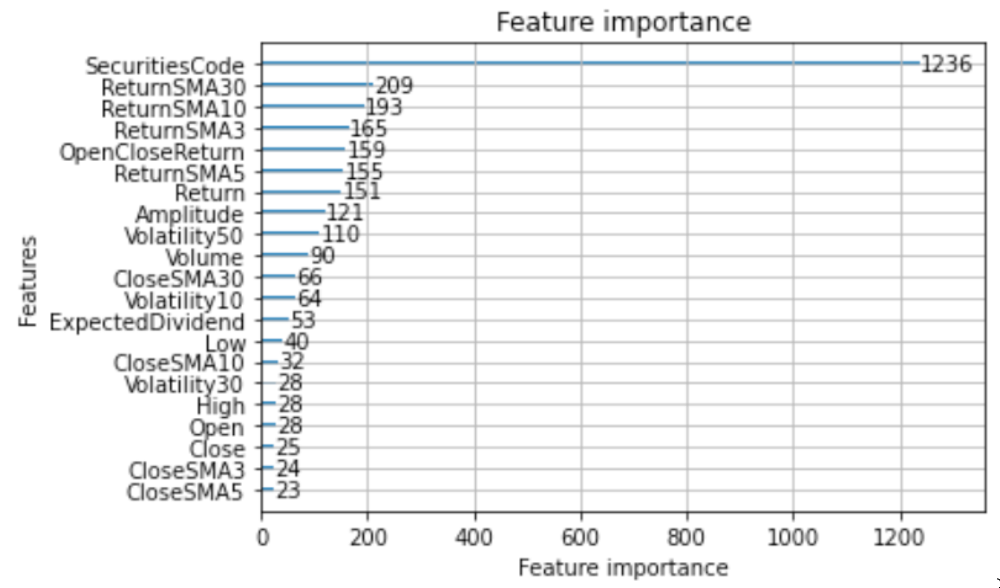

# Summary

Generally this was a rather simple LGBM model. The key was to use a non-linear model but to keep it simple. The features were raw as well as some features based on finance theory – volatility, moving averages etc. Popular lightgbm python library was used and the training was rather quick as the dataset was not massive.

# Features Selection / Engineering

The feature importance graph is provided below:

The most important feature was the actual stock code. This is somewhat sensible as it aggregates a lot of the data about the stock we don’t have access to.
After that return moving averages, therefore; we can probably conclude that the model learns something related to some kind of momentum strategy.
The feature selection process was not really extensive. Initially I wanted to try out various things. But due to lack of time I just stuck with something that was simple and sensible to use.
Obviously, these features are highly correlated and there are a lot of interesting techniques that could be used to combat that. However, I left it to lgbm to deal with that.

# Training Method(s)

Locally, I used optuna to find the best hyper parameters. It was important to properly set a cross validation scheme here. For this, I used walk-forward cross-validation with 5 chunks and a small gap between training and validation set in each split.

# Interesting findings

An important thing that I would mention is that due to large noise it is often not really important to look at the leaderboard. I focused on having locally good results and actually never cared about the leaderboard at all. This is psychologically hard to do but as it turns out pays off as regularisation towards overfitting!

# Simple Features and Methods

Generally, I believe that this model is simple enough. There is really very low performance-simplicity trade off. If not, I would even consider extending the feature set.

# Model Execution Time

Generally as mentioned above, the model is quick to train. The execution time is also negligible compared to the overall setup of trading the stock only once a day.

# References

SUBMISSION MODEL  
Very briefly here:
The model and the notebook can be found here:  
https://www.kaggle.com/code/vuk1998/jpx-submission-template/notebook?scriptVersionId=95590449

The discussion post can be found here:  
https://www.kaggle.com/competitions/jpx-tokyo-stock-exchange-prediction/discussion/361127

The only required packages are numpy, pandas and lightbm. Any newer versions should work.
